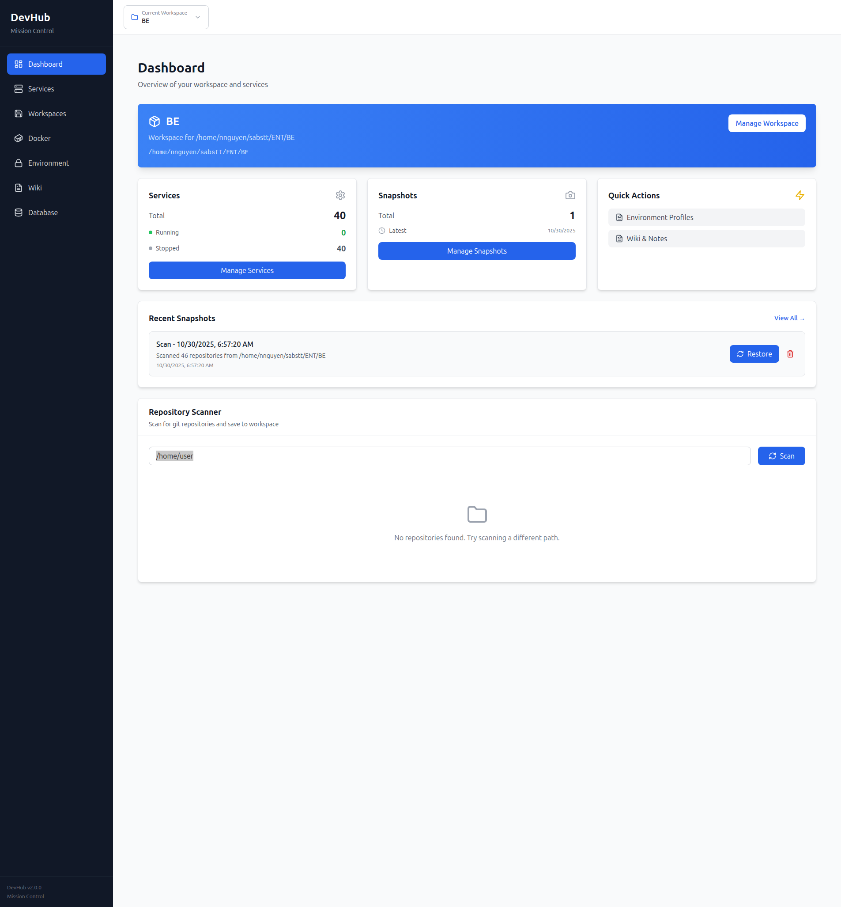
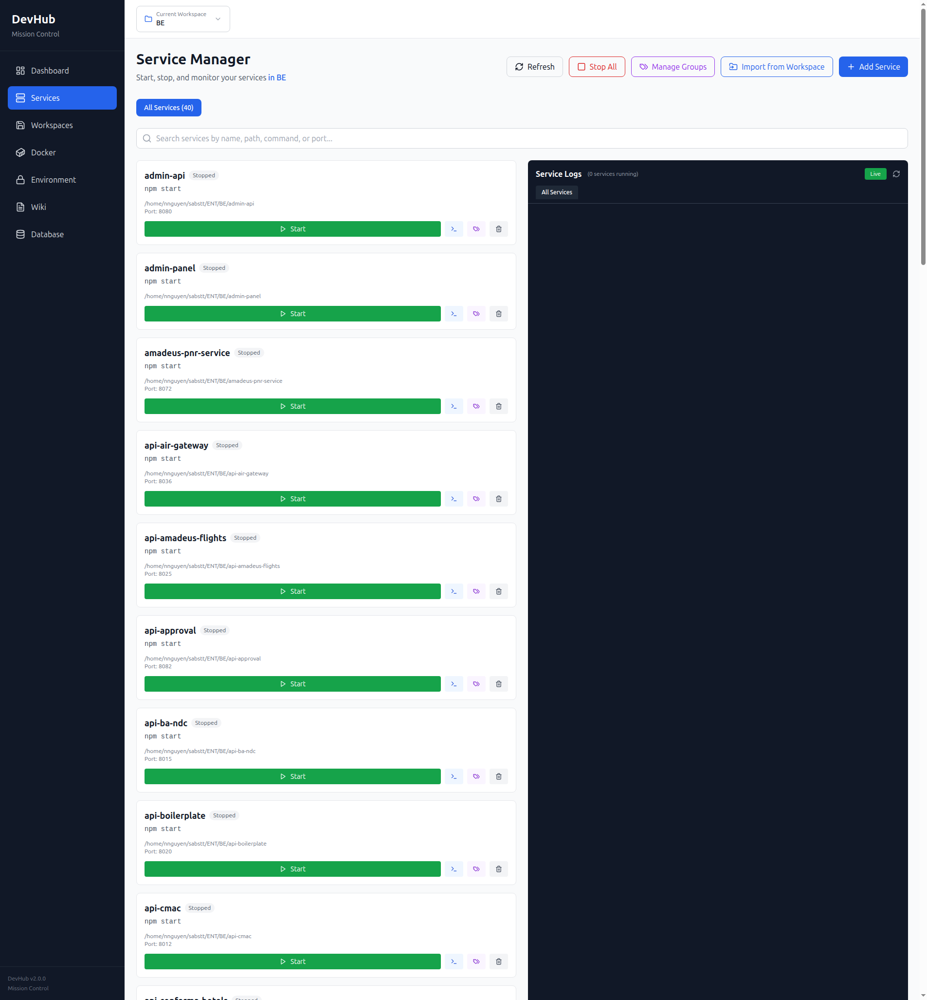
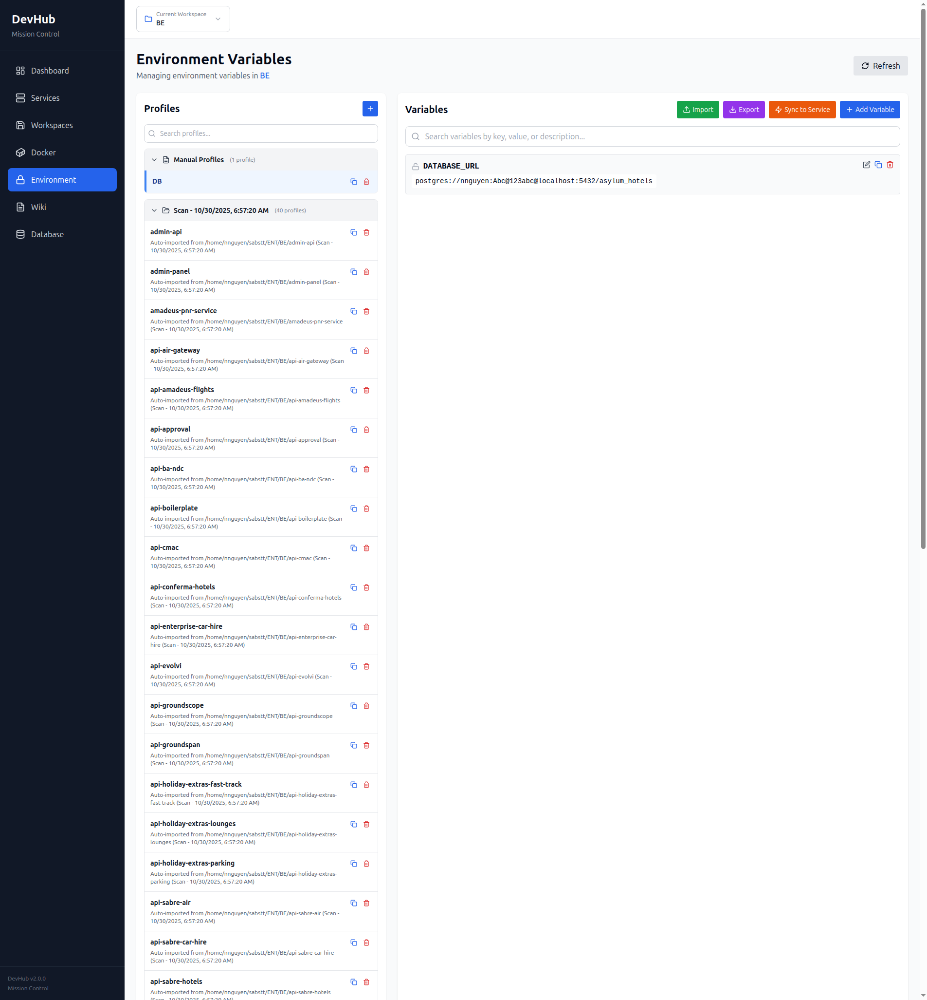
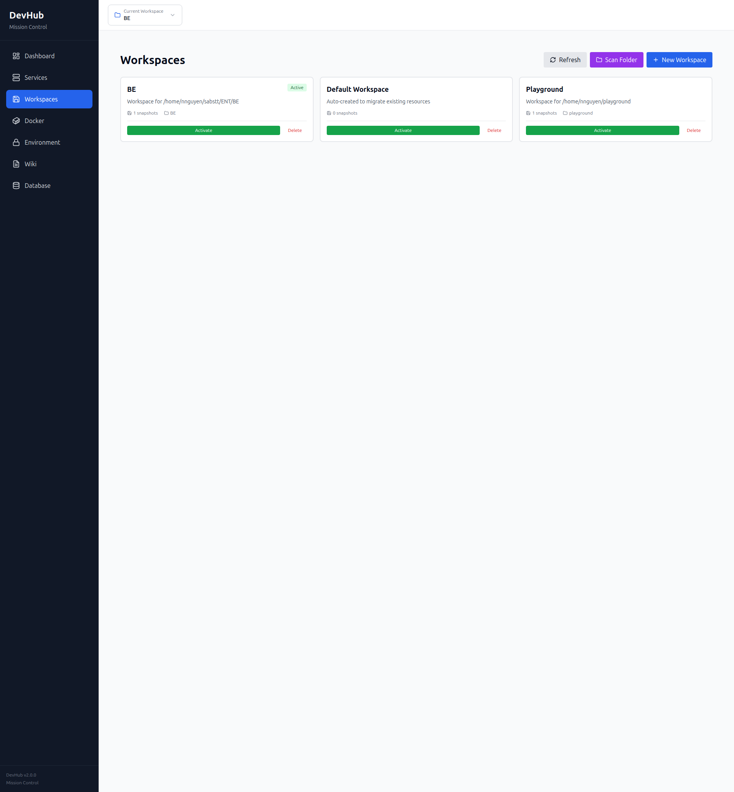

# DevHub - Developer Mission Control


**One dashboard to rule all your microservices**

DevHub helps developers manage their local microservices ecosystem with git repository scanning, service orchestration, Docker management, environment configuration, and documentation—all in one interface.



## Features

- **Repository Dashboard** - Scan and monitor git repositories
- **Service Manager** - Start/stop services, view real-time logs
- **Docker Integration** - Build images, manage containers
- **Environment Manager** - AES-256 encrypted environment variables
- **Workspaces** - Organize projects with snapshots
- **Wiki/Notes** - Markdown documentation with bidirectional linking

## Quick Start

### Web Application

```bash
git clone https://github.com/ngannguyen-nvn/devhub.git
cd devhub
npm install
npm run dev
```

Open http://localhost:3000

### VSCode Extension

1. Download `devhub-2.0.0.vsix` from [releases](https://github.com/ngannguyen-nvn/devhub/releases)
2. In VSCode: `Cmd/Ctrl+Shift+P` → "Extensions: Install from VSIX..."
3. Select the downloaded file and reload

## Screenshots

<details>
<summary>View more screenshots</summary>

### Services


### Environment Variables


### Workspaces


### Wiki


</details>

## Project Structure

```
devhub/
├── packages/core/              # Shared business logic
├── backend/                    # Express API server
├── frontend/                   # React + Vite web UI
├── packages/vscode-extension/  # VSCode extension
└── shared/                     # TypeScript types
```

## Documentation

- [CONTRIBUTING.md](CONTRIBUTING.md) - Contribution guidelines
- [SECURITY.md](SECURITY.md) - Security policy
- [packages/vscode-extension/README.md](packages/vscode-extension/README.md) - VSCode extension docs

## Contributing

See [CONTRIBUTING.md](CONTRIBUTING.md) for development setup and guidelines.

## License

[MIT](LICENSE)

---

Built with React, TypeScript, Express, and SQLite
